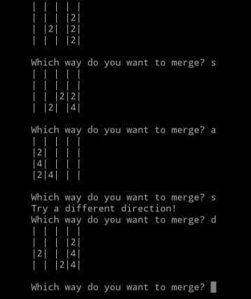

## How  to play a game ?
your goal is to combine values to get the number --n (you enter at the starting of game which should be power of 2)  by merging the board the board in different directions.  And you have to enter the size of board at the starting of game , will store in boardSize varible in game. Everytime you have to make a move to merge two colomns or row in your displayed board. Enter ' d ' to merge right, ' w ' to merge up, 'a'  to merge left, and ' s ' to merge down of board. if you enter some other key then it will show you an error

## How game looks is given below

## Rules:
### To merge: 
1. 'd' to merge right.
2. "w' to merge up
3. 'a' to merge left
4. 's' to merge down
### To Win:
1. You have to combine the values to get your goat (which you entered at the starting of game)
2. if your goal is reach then you will win the game
#other
1. if no moves left in any side(left, right , up or down) you have to make a move in different direction
2. if the board if completely filled and no moves left then you loose the game
                 ALL THE BEST
